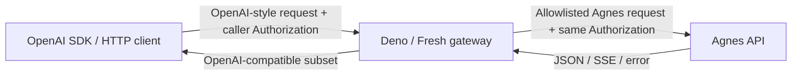

English | [简体中文](README.zh-CN.md)

# Agnes Compatible Gateway

[](https://github.com/4x25/agnes-compatible-gateway/actions/workflows/ci.yml)
[](https://deno.com/)
[](https://fresh.deno.dev/)
[](LICENSE)

> [Unofficial] OpenAI-compatible gateway for Agnes text, image, and video APIs.

Agnes Compatible Gateway is a small, stateless compatibility layer that accepts
a focused subset of OpenAI-style requests, translates them for the
[Agnes API](https://agnes-ai.com/), and converts Agnes responses back into
OpenAI-compatible shapes.

> [!IMPORTANT]
> This project implements an OpenAI-compatible subset, not the complete OpenAI
> API. Callers must provide their own Agnes API key. The project is not
> affiliated with or endorsed by Agnes AI or OpenAI.

> [!NOTE]
> **Project status:** the MVP is implemented and has passed the local automated
> suite and a real Agnes smoke test. Final validation on a Deno Deploy preview
> and the `v0.1.0` release are still pending.

## Highlights

- Familiar OpenAI-style routes for chat, image generation, JSON image editing,
  and video generation.
- Non-streaming chat and byte-preserving SSE streaming at the application layer.
- URL and `b64_json` image output, plus URL/Data URI image-edit inputs.
- JSON and OpenAI JavaScript SDK multipart video creation.
- Stateless video polling: Agnes `video_id` values are exposed directly as
  OpenAI-style `id` values.
- No model mapping, server-side API key, database, cache, queue, billing, or
  rate limiter.
- Deno Deploy-compatible Web Platform code and a non-root Docker runtime.
- OpenAI-style error envelopes while retaining Agnes status codes and safe
  request/rate-limit headers.

## API compatibility

Every supported route requires a non-empty `Authorization` header. The gateway
forwards its value unchanged and lets Agnes validate the credential.

| Method | Endpoint                       | Required input                                 | Compatibility behavior                                                           |
| ------ | ------------------------------ | ---------------------------------------------- | -------------------------------------------------------------------------------- |
| `POST` | `/v1/chat/completions`         | JSON: `model` and a non-empty `messages` array | Non-streaming JSON and streaming SSE; successful Agnes bodies are passed through |
| `POST` | `/v1/images/generations`       | JSON: `model`, `prompt`, and `size`            | URL output by default; `response_format=b64_json` is supported                   |
| `POST` | `/v1/images/edits`             | JSON: `model`, `prompt`, `size`, and `image`   | `image` is a URL/Data URI string or array; multipart edits are not supported     |
| `POST` | `/v1/videos`                   | JSON or multipart: `model` and `prompt`        | Supports text-to-video and public HTTP(S) reference images                       |
| `GET`  | `/v1/videos/:video_id`         | A non-empty video ID                           | Stateless Agnes status lookup returned as an OpenAI Video subset                 |
| `GET`  | `/v1/videos/:video_id/content` | A non-empty video ID                           | Completed: safe `302`; pending/failed: `409`; invalid completed URL: `502`       |

This table describes the complete public surface. Routes such as
`/v1/responses`, model listing, file upload, video listing, deletion, remixing,
and extension are outside the MVP.

## How it works



For each request, the gateway:

1. Requires the caller's `Authorization` header and validates only the fields
   required by the supported route.
2. Rebuilds the upstream payload from an explicit allowlist, silently omitting
   unsupported optional parameters.
3. Sends the caller's model name and authorization value to Agnes without
   mapping, substitution, or a server-side credential.
4. Passes through compatible bodies or applies the minimal image/video/error
   transformation required by the public contract.
5. Discards all request-local data when the response is complete. No
   credentials, assets, or task mappings are persisted.

## Quick start

### Requirements

- [Deno 2.9.2 or later](https://docs.deno.com/runtime/)
- Outbound HTTPS access to the Agnes API
- A caller-owned Agnes API key for real requests

Clone the repository, install the locked dependencies, and start the development
server:

```sh
git clone https://github.com/4x25/agnes-compatible-gateway.git
cd agnes-compatible-gateway
deno install --frozen
deno task dev
```

Use the URL printed by the development server. For a production-style local
server on port `8000`:

```sh
deno task build
deno task start
```

## Configuration

The gateway has one optional application setting:

| Variable         | Required | Default                          | Description                                                                                                                 |
| ---------------- | -------- | -------------------------------- | --------------------------------------------------------------------------------------------------------------------------- |
| `AGNES_BASE_URL` | No       | `https://apihub.agnes-ai.com/v1` | Absolute HTTP(S) Agnes base URL. It must end in `/v1`, may have a trailing slash, and must not contain a query or fragment. |

For example:

```sh
AGNES_BASE_URL=https://apihub.agnes-ai.com/v1 deno task start
```

Do **not** configure `AGNES_API_KEY`, `OPENAI_API_KEY`, or another fixed
credential on the gateway. API keys belong to callers and arrive only through
each request's `Authorization` header.

A custom `AGNES_BASE_URL` receives caller credentials. Configure only an
upstream that you operate or trust.

## Usage

The examples below assume the production-style local server. In Bash, read the
key without terminal echo and define a small helper that feeds the
`Authorization` header to curl through stdin instead of a process argument:

```bash
GATEWAY_URL=http://localhost:8000
read -rsp "Agnes API key: " AGNES_API_KEY
echo

gateway_curl() {
  printf 'Authorization: Bearer %s\n' "$AGNES_API_KEY" |
    curl --header @- "$@"
}
```

The variable and helper exist only in the caller's current shell; they are not
gateway configuration. In an application, obtain the caller key from an
appropriate secret source rather than embedding it in code.

### OpenAI JavaScript SDK

The automated contract suite verifies OpenAI JavaScript SDK `6.45.0` with chat
completions, image generation, and video creation:

```ts
import OpenAI from "npm:openai@6.45.0";

const apiKey = Deno.env.get("AGNES_API_KEY");
if (!apiKey) throw new Error("AGNES_API_KEY is required.");

const client = new OpenAI({
  apiKey,
  baseURL: "http://localhost:8000/v1",
  maxRetries: 0,
});

const completion = await client.chat.completions.create({
  model: "agnes-2.0-flash",
  messages: [{ role: "user", content: "Hello" }],
});

console.log(completion.choices[0].message.content);
```

Run the example against the local gateway with scoped permissions. The temporary
shell variable is passed to this SDK process through its environment, not its
arguments:

```bash
AGNES_API_KEY="$AGNES_API_KEY" \
  deno run --allow-env=AGNES_API_KEY --allow-net=localhost:8000 example.ts
```

`maxRetries: 0` is a safe default for media creation because client-side retries
can create duplicate image or video jobs. The gateway itself never automatically
retries upstream calls.

The SDK's `images.edit()` method is not compatible with the MVP because it sends
multipart files. Use the JSON endpoint shown below for image edits.

### Chat completion

```bash
gateway_curl "$GATEWAY_URL/v1/chat/completions" \
  -H "Content-Type: application/json" \
  -d '{
    "model": "agnes-2.0-flash",
    "messages": [
      {"role": "user", "content": "Hello"}
    ]
  }'
```

Set `"stream": true` and use `gateway_curl -N` to receive SSE chunks as Agnes
produces them:

```bash
gateway_curl -N "$GATEWAY_URL/v1/chat/completions" \
  -H "Content-Type: application/json" \
  -d '{
    "model": "agnes-2.0-flash",
    "messages": [
      {"role": "user", "content": "Reply with a short greeting"}
    ],
    "stream": true
  }'
```

### Image generation

```bash
gateway_curl "$GATEWAY_URL/v1/images/generations" \
  -H "Content-Type: application/json" \
  -d '{
    "model": "agnes-image-2.1-flash",
    "prompt": "A luminous floating city at sunrise",
    "size": "1024x768",
    "response_format": "url"
  }'
```

Use `"response_format": "b64_json"` for Base64 output.

### JSON image edit

```bash
gateway_curl "$GATEWAY_URL/v1/images/edits" \
  -H "Content-Type: application/json" \
  -d '{
    "model": "agnes-image-2.1-flash",
    "prompt": "Make the object orange",
    "size": "1024x768",
    "image": [
      "https://example.com/input.png"
    ],
    "response_format": "url"
  }'
```

`image` may be one string or an array of strings. The gateway forwards URL and
Data URI strings without downloading or decoding them.

### Video lifecycle

Create a video:

```bash
gateway_curl "$GATEWAY_URL/v1/videos" \
  -H "Content-Type: application/json" \
  -d '{
    "model": "agnes-video-v2.0",
    "prompt": "The subject turns toward the camera",
    "input_reference": {
      "image_url": "https://example.com/start.png"
    },
    "seconds": "4",
    "size": "1280x720"
  }'
```

The response exposes Agnes `video_id` as `id`. Use that value to poll without
any gateway-side task state:

```bash
export VIDEO_ID=video_xxx

gateway_curl "$GATEWAY_URL/v1/videos/$VIDEO_ID"
```

Once the status is `completed`, request the content endpoint:

```bash
gateway_curl --include "$GATEWAY_URL/v1/videos/$VIDEO_ID/content"
```

The gateway returns `302` with the completed asset URL in `Location`,
`Cache-Control: no-store`, and `Referrer-Policy: no-referrer`. When following
that URL manually, do not forward the Agnes `Authorization` header to the
external asset host.

Remove the caller-side variables when finished:

```bash
unset -f gateway_curl
unset AGNES_API_KEY GATEWAY_URL VIDEO_ID
```

## Deployment

### Deno Deploy

1. Import this repository into [Deno Deploy](https://deno.com/deploy).
2. Set the build command to `deno task build`.
3. Set the application entrypoint to `_fresh/server.js`.
4. Optionally set `AGNES_BASE_URL`. Do not add an API key.
5. Validate a preview deployment before promoting it.

See the [deployment guide](docs/DEPLOYMENT.md) for reverse-proxy requirements,
the manual smoke checklist, and rollback guidance. In particular, disable proxy
buffering for chat SSE and review body-size limits for Data URI edits.

### Docker

No prebuilt image is published yet. Build the multi-stage image from source:

```sh
docker build -t agnes-compatible-gateway:local .
docker run --rm -p 8000:8000 agnes-compatible-gateway:local
```

To use a trusted custom upstream:

```sh
docker run --rm -p 8000:8000 \
  -e AGNES_BASE_URL=https://example.com/v1 \
  agnes-compatible-gateway:local
```

The runtime container runs as the unprivileged `deno` user. Its Deno permissions
allow network access, reading files inside the container, and reading only the
listed Agnes/Fresh environment variables.

## Compatibility and limitations

- **Models:** each required `model` must be a non-empty string, but the gateway
  has no model list and does not map, alias, replace, or default model names.
  Agnes response model values are not rewritten.
- **Unknown parameters:** unsupported or unmappable optional parameters are
  silently omitted instead of causing local errors.
- **Chat:** `messages` are not deeply rewritten. Supported optional fields are
  `temperature`, `top_p`, `max_tokens`, `stream`, `tools`, `tool_choice`, and
  `chat_template_kwargs`. `max_completion_tokens` maps to `max_tokens` only when
  `max_tokens` is absent.
- **Streaming:** the application passes Agnes SSE chunks through without
  aggregation or event rewriting. A reverse proxy or hosting platform can still
  buffer traffic and must be configured separately.
- **Image generation:** URL output is the default. Current Agnes runtime
  behavior requires two upstream flags for `b64_json`, which the gateway sets
  automatically.
- **Image edits:** only JSON URL/Data URI strings are supported. Multipart
  files, masks, and `file_id` inputs are outside the MVP. Inputs are neither
  fetched nor decoded by the gateway.
- **Video duration:** `seconds` values `4`, `8`, and `12` map to 24 FPS and
  `97`, `193`, and `289` frames. Other values are ignored so Agnes can use its
  default.
- **Video size:** a valid `WIDTHxHEIGHT` value maps to integer `width` and
  `height`. Invalid values are ignored.
- **Video references:** only public HTTP(S) reference-image URLs are mapped.
  Uploaded files, `file_id` references, and Data URIs are ignored.
- **Video content:** thumbnail and spritesheet variants are not implemented. A
  valid completed asset returns `302` with `no-store` and `no-referrer`
  protections; a completed response with a missing, malformed, or non-HTTP(S)
  URL returns `502`.
- **Video metadata:** fields Agnes does not provide during lookup are omitted,
  not fabricated.
- **CORS and platform services:** CORS, user authentication, billing, quotas,
  rate limiting, storage, and job orchestration are not included.
- **Retries:** the gateway never retries Agnes calls. Callers should decide
  their own policy carefully, especially for image and video creation.

Agnes non-2xx status codes are retained and normalized to an OpenAI-style error
body:

```json
{
  "error": {
    "message": "Error message",
    "type": "invalid_request_error",
    "param": null,
    "code": null
  }
}
```

Network failures return `502`. Missing authorization returns `401` before Agnes
is called. Safe request IDs, rate-limit headers, and `Retry-After` are retained
when Agnes supplies them.

## Security model

- Every public API call requires `Authorization`, which is forwarded unchanged
  for that request only.
- The gateway does not read a server-side key, persist credentials, or add
  application-level logs for headers, bodies, prompts, Data URIs, or asset URLs.
- Request bodies exist in memory only long enough to validate and transform the
  current call. Platform request-size and memory limits still apply.
- No credentials, generated assets, user data, or video task mappings are
  stored.
- Use HTTPS in production. The deployment operator, reverse proxy, hosting
  platform, and configured Agnes-compatible upstream remain part of the trust
  boundary and must be configured not to log secrets.
- Never put a live credential in source, issues, test fixtures, command
  arguments, container configuration, or CI. Use a disposable caller-owned key
  for manual smoke tests and revoke it afterward.

## Development and testing

| Command                   | Purpose                                                                          |
| ------------------------- | -------------------------------------------------------------------------------- |
| `deno install --frozen`   | Install exactly the versions in `deno.lock`                                      |
| `deno task dev`           | Start the Fresh/Vite development server                                          |
| `deno task check`         | Check formatting, lint rules, and TypeScript types                               |
| `deno task test`          | Run mocked endpoint contracts and the OpenAI SDK test                            |
| `deno task test:coverage` | Collect profiles under `coverage/` and print a local coverage report             |
| `deno task build`         | Build the Fresh production bundle under `_fresh/`                                |
| `deno task start`         | Serve an existing production bundle on port `8000`                               |
| `deno task smoke`         | Run the opt-in, side-effectful real-Agnes smoke suite with a key read from stdin |

Normal tests use an injected mock upstream. They require no network access or
real API key. The GitHub Actions workflow runs frozen installation, formatting,
linting, type checks, 25 automated tests, the Fresh build, and a Docker build.

The live smoke task creates real image and video jobs and may incur usage. It is
never run by CI. Follow the credential-safe procedure in the
[deployment guide](docs/DEPLOYMENT.md#manual-smoke-checklist).

### Repository layout

| Path                          | Purpose                                                                   |
| ----------------------------- | ------------------------------------------------------------------------- |
| `gateway/`                    | App factory, route handlers, transformations, errors, and Agnes transport |
| `tests/`                      | Mocked endpoint contracts and OpenAI JavaScript SDK compatibility test    |
| `scripts/live_smoke.ts`       | Opt-in real-Agnes smoke runner                                            |
| `docs/IMPLEMENTATION_PLAN.md` | Milestones, decisions, acceptance matrix, and live findings               |
| `docs/DEPLOYMENT.md`          | Deno Deploy, Docker, proxy, smoke, and rollback guidance                  |
| `main.ts`                     | Production Fresh entrypoint                                               |

## Project status and roadmap

The MVP implementation, including stateless video download, is complete. The
automated suite contains 25 tests, and the full real-Agnes smoke checklist was
completed on 2026-07-10 with a temporary caller-owned key.

Before `v0.1.0`, the remaining release gates are:

- repeat the smoke checklist against the final Deno Deploy preview revision;
- publish and tag `v0.1.0` only after that preview passes.

Progress, acceptance criteria, protocol decisions, and verified Agnes runtime
behavior are tracked in the
[MVP implementation plan](docs/IMPLEMENTATION_PLAN.md).

## Contributing

Contributions that preserve the focused, stateless compatibility scope are
welcome.

1. Open an issue before a substantial API or architecture change.
2. Read [`AGENTS.md`](AGENTS.md) for project invariants, coding standards,
   security rules, and testing requirements.
3. Keep changes focused, add or update contract tests, and document public
   behavior.
4. Run `deno task check`, `deno task test`, `deno task build`, and
   `git diff --check` before opening a pull request.
5. Describe compatibility changes, security implications, tests run, and any
   remaining external validation in the pull request.

Repository artifacts are written in English by default. Explicitly maintained
localized documents, such as [`README.zh-CN.md`](README.zh-CN.md), are
exceptions.

## License

Licensed under the [MIT License](LICENSE). Copyright © 2026 4×25.

## Disclaimer

This is an independent, unofficial community project. It is not affiliated with,
sponsored by, or endorsed by Agnes AI or OpenAI. Product names and trademarks
belong to their respective owners. Use the gateway and upstream services in
accordance with their applicable terms and policies.
