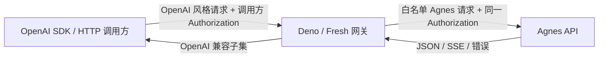

[English](README.md) | 简体中文

# Agnes Compatible Gateway

[](https://github.com/4x25/agnes-compatible-gateway/actions/workflows/ci.yml)
[](https://deno.com/)
[](https://fresh.deno.dev/)
[](LICENSE)

> [Unofficial] OpenAI-compatible gateway for Agnes text, image, and video APIs.

Agnes Compatible Gateway 是一个轻量、无状态的兼容层。它接收一组明确限定的 OpenAI
风格请求，将其转换后发送给 [Agnes API](https://agnes-ai.com/)，再把 Agnes
响应转换为 OpenAI 兼容格式。

> [!IMPORTANT]
> 本项目实现的是 OpenAI 兼容子集，并非完整的 OpenAI API。调用方必须提供自己的
> Agnes API key。本项目与 Agnes AI、OpenAI 均无隶属关系，也未获得其官方认可。

> [!NOTE]
> **项目状态：**MVP 已实现，并已通过本地自动化测试和真实 Agnes 冒烟测试。最终
> Deno Deploy 预览环境验证与 `v0.1.0` 发布仍待完成。

## 核心特性

- 为聊天、图像生成、JSON 图像编辑和视频生成提供熟悉的 OpenAI 风格路由。
- 支持非流式聊天，并在应用层原样透传 SSE 字节流。
- 支持 URL 与 `b64_json` 图像输出，以及 URL/Data URI 图像编辑输入。
- 视频创建同时支持 JSON 和 OpenAI JavaScript SDK multipart 请求。
- 无状态视频轮询：直接将 Agnes `video_id` 作为 OpenAI 风格的 `id` 返回。
- 不做模型映射，不使用服务端 API key，不引入数据库、缓存、队列、计费或限流。
- 使用兼容 Deno Deploy 的 Web Platform API，并提供非 root Docker 运行时。
- 统一返回 OpenAI 风格错误结构，同时保留 Agnes 状态码及安全的请求
  ID、限流响应头。

## API 兼容范围

所有受支持路由都要求非空的 `Authorization` 请求头。网关会原值转发该请求头，凭据
有效性由 Agnes 判断。

| 方法   | 路径                           | 必填输入                                 | 兼容行为                                                    |
| ------ | ------------------------------ | ---------------------------------------- | ----------------------------------------------------------- |
| `POST` | `/v1/chat/completions`         | JSON：`model` 和非空 `messages` 数组     | 支持非流式 JSON 与流式 SSE；Agnes 成功响应体直接透传        |
| `POST` | `/v1/images/generations`       | JSON：`model`、`prompt`、`size`          | 默认返回 URL；支持 `response_format=b64_json`               |
| `POST` | `/v1/images/edits`             | JSON：`model`、`prompt`、`size`、`image` | `image` 为 URL/Data URI 字符串或数组；不支持 multipart 编辑 |
| `POST` | `/v1/videos`                   | JSON 或 multipart：`model`、`prompt`     | 支持文生视频和公开 HTTP(S) 参考图                           |
| `GET`  | `/v1/videos/:video_id`         | 非空视频 ID                              | 无状态查询 Agnes，并返回 OpenAI Video 对象子集              |
| `GET`  | `/v1/videos/:video_id/content` | 非空视频 ID                              | 已完成：安全 `302`；等待中/失败：`409`；无效完成 URL：`502` |

上表就是完整的公开接口范围。`/v1/responses`、模型列表、文件上传、视频列表、删除、
混剪和扩展等能力不在 MVP 范围内。

## 工作原理



对于每个请求，网关会：

1. 要求调用方提供 `Authorization`，并且只验证当前路由所需的必填字段。
2. 根据显式白名单重新构建上游请求体，静默丢弃不支持的可选参数。
3. 将调用方提供的模型名和鉴权值发送给 Agnes，不做模型映射、替换，也不使用服务端
   凭据。
4. 直接透传兼容的响应体，或执行公开契约所需的最小图像、视频与错误转换。
5. 响应完成后丢弃所有请求级数据，不持久化凭据、生成内容或任务映射。

## 快速开始

### 环境要求

- [Deno 2.9.2 或更高版本](https://docs.deno.com/runtime/)
- 能够通过 HTTPS 访问 Agnes API
- 发起真实请求时，需要调用方自有的 Agnes API key

克隆仓库、安装 lockfile 中固定的依赖并启动开发服务器：

```sh
git clone https://github.com/4x25/agnes-compatible-gateway.git
cd agnes-compatible-gateway
deno install --frozen
deno task dev
```

请使用开发服务器输出的地址。如需在 `8000` 端口以接近生产环境的方式本地运行：

```sh
deno task build
deno task start
```

## 配置

网关只有一个可选的应用配置项：

| 变量             | 是否必填 | 默认值                           | 说明                                                                                         |
| ---------------- | -------- | -------------------------------- | -------------------------------------------------------------------------------------------- |
| `AGNES_BASE_URL` | 否       | `https://apihub.agnes-ai.com/v1` | Agnes 的绝对 HTTP(S) 基址。必须以 `/v1` 结尾，可以包含尾随斜杠，不能包含 query 或 fragment。 |

例如：

```sh
AGNES_BASE_URL=https://apihub.agnes-ai.com/v1 deno task start
```

不要在网关上配置 `AGNES_API_KEY`、`OPENAI_API_KEY` 或其他固定凭据。API key 属于
调用方，只应通过每次请求的 `Authorization` 请求头传入。

自定义 `AGNES_BASE_URL` 会接收调用方凭据，因此只能配置为你自行运营或信任的上游。

## 使用方式

以下示例假设网关已在本地以生产模式运行。在 Bash 中隐藏读取 key，并定义一个小型
helper，通过 stdin 向 curl 提供 `Authorization` 请求头，避免将其放入进程参数：

```bash
GATEWAY_URL=http://localhost:8000
read -rsp "Agnes API key: " AGNES_API_KEY
echo

gateway_curl() {
  printf 'Authorization: Bearer %s\n' "$AGNES_API_KEY" |
    curl --header @- "$@"
}
```

该变量和 helper 只存在于调用方当前 shell 中，并不是网关配置。实际应用应从合适的
密钥来源读取调用方 key，不要将其写死在代码中。

### OpenAI JavaScript SDK

自动化契约测试已使用 OpenAI JavaScript SDK `6.45.0` 验证聊天补全、图像生成和视频
创建：

```ts
import OpenAI from "npm:openai@6.45.0";

const apiKey = Deno.env.get("AGNES_API_KEY");
if (!apiKey) throw new Error("AGNES_API_KEY is required.");

const client = new OpenAI({
  apiKey,
  baseURL: "http://localhost:8000/v1",
  maxRetries: 0,
});

const completion = await client.chat.completions.create({
  model: "agnes-2.0-flash",
  messages: [{ role: "user", content: "Hello" }],
});

console.log(completion.choices[0].message.content);
```

使用范围受限的权限对本地网关运行示例。临时 shell 变量会通过环境传入 SDK 进程，
不会出现在进程参数中：

```bash
AGNES_API_KEY="$AGNES_API_KEY" \
  deno run --allow-env=AGNES_API_KEY --allow-net=localhost:8000 example.ts
```

媒体创建时使用 `maxRetries: 0`
是更安全的默认值，因为客户端重试可能重复创建图像或
视频任务。网关自身不会自动重试任何上游请求。

SDK 的 `images.edit()` 方法会发送 multipart 文件，因此与 MVP 不兼容。图像编辑请
使用下方 JSON 接口。

### 聊天补全

```bash
gateway_curl "$GATEWAY_URL/v1/chat/completions" \
  -H "Content-Type: application/json" \
  -d '{
    "model": "agnes-2.0-flash",
    "messages": [
      {"role": "user", "content": "Hello"}
    ]
  }'
```

设置 `"stream": true` 并使用 `gateway_curl -N`，即可在 Agnes 生成 SSE
分块时逐块接收：

```bash
gateway_curl -N "$GATEWAY_URL/v1/chat/completions" \
  -H "Content-Type: application/json" \
  -d '{
    "model": "agnes-2.0-flash",
    "messages": [
      {"role": "user", "content": "Reply with a short greeting"}
    ],
    "stream": true
  }'
```

### 图像生成

```bash
gateway_curl "$GATEWAY_URL/v1/images/generations" \
  -H "Content-Type: application/json" \
  -d '{
    "model": "agnes-image-2.1-flash",
    "prompt": "A luminous floating city at sunrise",
    "size": "1024x768",
    "response_format": "url"
  }'
```

将 `response_format` 设为 `"b64_json"` 即可获得 Base64 输出。

### JSON 图像编辑

```bash
gateway_curl "$GATEWAY_URL/v1/images/edits" \
  -H "Content-Type: application/json" \
  -d '{
    "model": "agnes-image-2.1-flash",
    "prompt": "Make the object orange",
    "size": "1024x768",
    "image": [
      "https://example.com/input.png"
    ],
    "response_format": "url"
  }'
```

`image` 可以是一个字符串或字符串数组。网关不会下载或解码输入，而是直接转发 URL
和 Data URI 字符串。

### 视频生命周期

创建视频：

```bash
gateway_curl "$GATEWAY_URL/v1/videos" \
  -H "Content-Type: application/json" \
  -d '{
    "model": "agnes-video-v2.0",
    "prompt": "The subject turns toward the camera",
    "input_reference": {
      "image_url": "https://example.com/start.png"
    },
    "seconds": "4",
    "size": "1280x720"
  }'
```

响应会将 Agnes `video_id` 暴露为 `id`。使用该值即可轮询，不需要任何网关侧任务
状态：

```bash
export VIDEO_ID=video_xxx

gateway_curl "$GATEWAY_URL/v1/videos/$VIDEO_ID"
```

状态变为 `completed` 后，请求内容接口：

```bash
gateway_curl --include "$GATEWAY_URL/v1/videos/$VIDEO_ID/content"
```

网关返回 `302`，在 `Location` 中提供已完成资源的 URL，并设置
`Cache-Control: no-store` 和 `Referrer-Policy: no-referrer`。手动访问该地址时，
不要把 Agnes `Authorization` 请求头转发给外部资源域名。

使用完成后，清理调用方环境变量：

```bash
unset -f gateway_curl
unset AGNES_API_KEY GATEWAY_URL VIDEO_ID
```

## 部署

### Deno Deploy

1. 将本仓库导入 [Deno Deploy](https://deno.com/deploy)。
2. 将构建命令设为 `deno task build`。
3. 将应用入口设为 `_fresh/server.js`。
4. 按需设置 `AGNES_BASE_URL`，不要添加 API key。
5. 在提升到正式环境前验证预览部署。

反向代理要求、手工冒烟检查和回滚说明请参阅[部署指南](docs/DEPLOYMENT.md)。尤其需要
关闭聊天 SSE 的代理缓冲，并根据 Data URI 编辑请求调整请求体大小限制。

### Docker

项目暂未发布预构建镜像，请从源码构建多阶段镜像：

```sh
docker build -t agnes-compatible-gateway:local .
docker run --rm -p 8000:8000 agnes-compatible-gateway:local
```

如需使用可信的自定义上游：

```sh
docker run --rm -p 8000:8000 \
  -e AGNES_BASE_URL=https://example.com/v1 \
  agnes-compatible-gateway:local
```

运行时容器使用非特权 `deno` 用户。Deno 权限允许访问网络、读取容器内文件，并且
只能读取列出的 Agnes/Fresh 环境变量。

## 兼容性与限制

- **模型：**每个必填 `model`
  都必须是非空字符串，但网关没有模型列表，也不会映射、
  设置别名、替换或补充默认模型名。Agnes 响应中的模型值不会被改写。
- **未知参数：**不支持或无法映射的可选参数会被静默丢弃，不会导致本地报错。
- **聊天：**不会深度改写 `messages`。支持的可选字段为 `temperature`、`top_p`、
  `max_tokens`、`stream`、`tools`、`tool_choice` 和
  `chat_template_kwargs`。仅在没有 `max_tokens` 时将 `max_completion_tokens`
  映射为 `max_tokens`。
- **流式响应：**应用层不会聚合或改写 Agnes SSE 事件。反向代理和托管平台仍可能
  缓冲流量，需要单独配置。
- **图像生成：**默认使用 URL 输出。Agnes 当前运行时要求为 `b64_json` 设置两个
  上游标记，网关会自动处理。
- **图像编辑：**仅支持 JSON URL/Data URI 字符串。不支持 multipart 文件、mask 和
  `file_id`。网关不会拉取或解码输入。
- **视频时长：** `seconds` 为 `4`、`8`、`12` 时，分别映射为 24 FPS 和 `97`、
  `193`、`289` 帧。其他值会被忽略，由 Agnes 使用默认值。
- **视频尺寸：**合法的 `WIDTHxHEIGHT` 会映射为整数 `width` 和 `height`，非法值
  会被忽略。
- **视频参考图：**只映射公开 HTTP(S) 参考图 URL。上传文件、`file_id` 和 Data URI
  会被忽略。
- **视频内容：**未实现缩略图和 spritesheet 变体。合法的已完成资源会返回带有
  `no-store` 和 `no-referrer` 保护的 `302`；完成响应中的 URL 缺失、格式错误或
  不是 HTTP(S) 时返回 `502`。
- **视频元数据：**Agnes 查询响应中没有提供的字段会直接省略，不会伪造。
- **CORS 与平台能力：**不包含 CORS、用户认证、计费、配额、限流、存储和任务编排。
- **重试：**网关不会重试 Agnes 请求。调用方应谨慎制定自己的重试策略，图像和视频
  创建尤其如此。

Agnes 非 2xx 状态码会保留，并被统一转换为 OpenAI 风格错误体：

```json
{
  "error": {
    "message": "Error message",
    "type": "invalid_request_error",
    "param": null,
    "code": null
  }
}
```

网络故障返回 `502`。缺少鉴权时会在调用 Agnes 前返回 `401`。如果 Agnes 提供了安全
的请求 ID、限流响应头或 `Retry-After`，网关会保留它们。

## 安全模型

- 每个公开 API 请求都需要 `Authorization`，其值只会为当前请求原样转发。
- 网关不读取服务端固定 key，不持久化凭据，也不添加记录请求头、请求体、prompt、
  Data URI 或资源 URL 的应用级日志。
- 请求体只会在当前请求的验证和转换期间短暂存在于内存中，仍受部署平台请求大小和
  内存限制约束。
- 不存储凭据、生成资源、用户数据或视频任务映射。
- 生产环境应使用 HTTPS。部署运维方、反向代理、托管平台以及配置的 Agnes 兼容上游
  都属于信任边界，必须确保它们不会记录敏感信息。
- 不要把真实凭据写入源码、Issue、测试夹具、命令行参数、容器配置或 CI。手工冒烟
  测试应使用调用方自有的一次性 key，并在完成后销毁。

## 开发与测试

| 命令                      | 用途                                                         |
| ------------------------- | ------------------------------------------------------------ |
| `deno install --frozen`   | 严格安装 `deno.lock` 中的依赖版本                            |
| `deno task dev`           | 启动 Fresh/Vite 开发服务器                                   |
| `deno task check`         | 检查格式、lint 规则和 TypeScript 类型                        |
| `deno task test`          | 运行 mock 接口契约测试和 OpenAI SDK 测试                     |
| `deno task test:coverage` | 在 `coverage/` 下收集数据并输出本地覆盖率报告                |
| `deno task build`         | 在 `_fresh/` 下构建 Fresh 生产产物                           |
| `deno task start`         | 在 `8000` 端口运行已有生产构建                               |
| `deno task smoke`         | 从 stdin 读取 key，按需运行会产生真实副作用的 Agnes 冒烟测试 |

常规测试使用注入的 mock 上游，不需要网络或真实 API key。GitHub Actions 工作流会
使用 lockfile 安装固定依赖，并执行格式检查、lint、类型检查、25
个自动化测试、Fresh 构建和 Docker 构建。

真实冒烟任务会创建图像和视频任务，可能产生用量，且绝不会在 CI 中运行。请遵循
[部署指南](docs/DEPLOYMENT.md#manual-smoke-checklist)中的凭据安全操作流程。

### 仓库结构

| 路径                          | 用途                                                    |
| ----------------------------- | ------------------------------------------------------- |
| `gateway/`                    | 应用工厂、路由处理、数据转换、错误处理和 Agnes 上游传输 |
| `tests/`                      | mock 接口契约测试和 OpenAI JavaScript SDK 兼容测试      |
| `scripts/live_smoke.ts`       | 按需运行的真实 Agnes 冒烟脚本                           |
| `docs/IMPLEMENTATION_PLAN.md` | 里程碑、决策、验收矩阵和真实接口验证结果                |
| `docs/DEPLOYMENT.md`          | Deno Deploy、Docker、反向代理、冒烟和回滚指南           |
| `main.ts`                     | Fresh 生产入口                                          |

## 项目状态与路线图

包括无状态视频下载在内的 MVP 实现工作已经完成。自动化测试套件包含 25
个测试，并已 于 2026-07-10 使用调用方提供的临时 key 完成整套真实 Agnes
冒烟检查。

`v0.1.0` 之前仍有以下发布门槛：

- 在最终 Deno Deploy 预览版本上重复冒烟检查；
- 仅在预览检查通过后发布并标记 `v0.1.0`。

开发进度、验收标准、协议决策和已验证的 Agnes 运行时行为记录在
[MVP 实施计划](docs/IMPLEMENTATION_PLAN.md)中。

## 参与贡献

欢迎提交符合本项目轻量、无状态兼容范围的贡献。

1. 大幅调整 API 或架构前，请先创建 Issue 讨论。
2. 阅读 [`AGENTS.md`](AGENTS.md)，了解项目不变量、编码规范、安全要求和测试规则。
3. 保持改动聚焦，新增或更新契约测试，并记录公开行为的变化。
4. 提交 Pull Request 前运行 `deno task check`、`deno task test`、
   `deno task build` 和 `git diff --check`。
5. 在 Pull Request
   中说明兼容性变化、安全影响、已运行测试以及尚未完成的外部验证。

仓库落盘内容默认使用英文。明确维护的本地化文档（例如本简体中文
README）属于例外。

## 许可证

本项目采用 [MIT License](LICENSE)。Copyright © 2026 4×25。

## 免责声明

本项目是独立、非官方的社区项目，与 Agnes AI 或 OpenAI 没有隶属、赞助或认可关系。
产品名称和商标归各自权利人所有。使用本项目及上游服务时，请遵守各自适用的条款和
政策。
